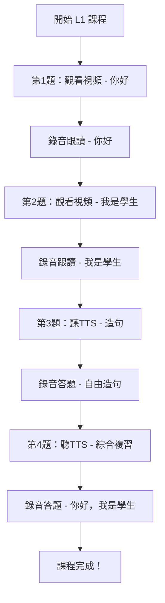

# L1 課程視頻更新總結 🎉

## ✅ 任務完成

成功為 **L1: Self Introduction** 課程添加了 2 個 YouTube Shorts 視頻！

---

## 📹 添加的視頻

### 第 1 題：你好 (Hello)
- **視頻 URL**: `https://youtube.com/shorts/LaKpMsKzAlI`
- **學習目標**: 學習如何用中文打招呼
- **期望答案**: 你好
- **字幕**: 3 段（0-9 秒）

### 第 2 題：我是學生 (I am a student)
- **視頻 URL**: `https://youtube.com/shorts/7l51ah8ktKc`
- **學習目標**: 學習如何用中文自我介紹
- **期望答案**: 我是學生
- **字幕**: 3 段（0-10 秒）

---

## 🎯 L1 課程完整結構

```
L1: Self Introduction (4 題)
│
├── 📹 第 1 題：你好 (Hello)
│   ├── YouTube Shorts 視頻
│   ├── 3 段字幕
│   └── 學習打招呼
│
├── 📹 第 2 題：我是學生 (I am a student)
│   ├── YouTube Shorts 視頻
│   ├── 3 段字幕
│   └── 學習自我介紹
│
├── 🔊 第 3 題：造句練習
│   ├── TTS 語音
│   └── 靈活運用「我是」
│
└── 🔊 第 4 題：綜合複習
    ├── TTS 語音
    └── 完整句子練習
```

---

## 📊 字幕設計

### 第 1 題字幕（你好）
| 時間 | 內容 |
|------|------|
| 0-3s | "Watch and learn how to say '你好' (hello) in Chinese!" |
| 3-6s | "你好 (nǐ hǎo) - This is how Chinese people greet each other." |
| 6-9s | "Now it's your turn to practice!" |

### 第 2 題字幕（我是學生）
| 時間 | 內容 |
|------|------|
| 0-3s | "Learn how to introduce yourself in Chinese!" |
| 3-7s | "我是 (wǒ shì) means 'I am'. Say: 我是學生 (I am a student)." |
| 7-10s | "Practice introducing yourself now!" |

---

## 🎓 學習路徑



---

## 💡 教學設計理念

### 多媒體學習
- **視頻** → 視覺和聽覺雙重刺激
- **字幕** → 中英文輔助理解
- **TTS** → 標準發音示範
- **錄音** → 即時口語練習

### 漸進式難度
1. **觀看學習**（第1-2題）：通過視頻被動接收
2. **跟讀模仿**（第1-2題）：錄音跟讀固定句子
3. **靈活運用**（第3題）：自由造句
4. **綜合應用**（第4題）：完整對話

---

## 🔧 技術實現

### 視頻播放器
- ✅ 自動檢測 YouTube URL
- ✅ 使用 iframe 嵌入播放器
- ✅ 支持自動播放
- ✅ YouTube 原生控制列

### 字幕系統
- ✅ 顯示在視頻下方
- ✅ 灰色背景卡片樣式
- ✅ 中英文混合顯示
- ✅ 教學提示功能

### 智能降級
- ✅ 有視頻 → 播放視頻
- ✅ 無視頻 → 使用 TTS
- ✅ 完全向後兼容

---

## 📁 修改的文件

### 課程數據
- `apps/backend/src/plugins/chinese-lessons/L1.json`
  - 第 1 題添加視頻和字幕
  - 第 2 題添加視頻和字幕

### 前端代碼
- `apps/web/app/(protected)/lesson/[id]/page.tsx`
  - YouTube 檢測函數
  - URL 轉換函數
  - 視頻播放器 UI
  - 自動播放邏輯

### 文檔
- `VIDEO_FEATURE_IMPLEMENTATION.md` - 視頻功能實現
- `YOUTUBE_SUPPORT_UPDATE.md` - YouTube 支持
- `L1_YOUTUBE_VIDEO_ADDED.md` - 第 1 題更新
- `L1_QUESTION2_VIDEO_ADDED.md` - 第 2 題更新
- `L1_VIDEOS_SUMMARY.md` - **本文檔**

---

## 🧪 測試清單

### 基本功能測試
- [ ] L1 第 1 題顯示視頻播放器
- [ ] L1 第 1 題視頻自動播放
- [ ] L1 第 1 題字幕正確顯示
- [ ] L1 第 2 題顯示視頻播放器
- [ ] L1 第 2 題視頻自動播放
- [ ] L1 第 2 題字幕正確顯示
- [ ] L1 第 3 題使用 TTS（無視頻）
- [ ] L1 第 4 題使用 TTS（無視頻）

### 交互功能測試
- [ ] 可以暫停/播放視頻
- [ ] 可以調整視頻進度
- [ ] 可以全屏播放
- [ ] 視頻播放完後可以錄音
- [ ] 錄音功能正常
- [ ] 評分功能正常
- [ ] 完成報告正常生成

### 兼容性測試
- [ ] Chrome 瀏覽器正常
- [ ] Edge 瀏覽器正常
- [ ] Firefox 瀏覽器正常
- [ ] 手機瀏覽器正常

---

## 🚀 啟動測試

### 1. 啟動後端
```bash
cd apps/backend
npm run dev
```
服務運行在：`http://localhost:8082`

### 2. 啟動前端
```bash
cd apps/web
npm run dev
```
服務運行在：`http://localhost:3000`

### 3. 訪問課程
1. 打開瀏覽器訪問 `http://localhost:3000`
2. 登入系統
3. 選擇 **L1: Self Introduction** 課程
4. 依次完成 4 個題目

---

## 📈 預期效果

### 學習體驗提升
- 👀 **視覺學習**：看到真實的發音口型和表情
- 👂 **聽覺學習**：聽到地道的中文發音
- 💬 **字幕輔助**：中英文解釋幫助理解
- 🎯 **目標明確**：每題都有清晰的學習目標

### 學習效率提升
- ⏱️ **時間節省**：視頻比 TTS 更生動有趣
- 🔄 **重複學習**：可以反覆觀看視頻
- 📊 **進度追蹤**：完成報告記錄學習成果
- 🎓 **成就感**：完成視頻課程獲得鼓勵

---

## 💪 優勢特點

### 1. 真實視頻教學
- 比 TTS 更自然
- 有視覺輔助
- 更有代入感

### 2. YouTube Shorts 優化
- 短視頻適合學習
- 不會太長（通常 15-60 秒）
- 手機觀看友好

### 3. 靈活混合模式
- 前 2 題：視頻教學（基礎知識）
- 後 2 題：TTS 練習（實戰應用）
- 漸進式學習路徑

### 4. 完全可擴展
- 任何課程都可以添加視頻
- 支持多種視頻格式
- 字幕可自由配置

---

## 📝 JSON 數據示例

### 完整的題目數據（第 2 題）
```json
{
  "id": 2,
  "teacher": "Now let's learn to introduce yourself. In Chinese, '我是 (wǒ shì)' means 'I am'. For example: '我是學生 (wǒ shì xué shēng)' = 'I am a student'. Please try saying it.",
  "expected_answer": "我是學生",
  "pinyin": "wǒ shì xué shēng",
  "english_hint": "I am a student",
  "encouragement": "Excellent! Now you can introduce yourself.",
  "video_url": "https://youtube.com/shorts/7l51ah8ktKc",
  "captions": [
    {
      "text": "Learn how to introduce yourself in Chinese!",
      "start": 0,
      "end": 3
    },
    {
      "text": "我是 (wǒ shì) means 'I am'. Say: 我是學生 (I am a student).",
      "start": 3,
      "end": 7
    },
    {
      "text": "Practice introducing yourself now!",
      "start": 7,
      "end": 10
    }
  ]
}
```

---

## 🎯 下一步建議

### 短期（測試階段）
1. ✅ 在瀏覽器中測試 L1 課程
2. ✅ 驗證視頻播放和字幕顯示
3. ✅ 測試錄音和評分功能
4. ✅ 收集用戶反饋

### 中期（優化階段）
1. 📹 根據實際視頻長度調整字幕時間
2. 📝 優化字幕文本內容
3. 🎨 調整視頻播放器樣式
4. 📊 添加視頻播放統計

### 長期（擴展階段）
1. 🌍 為 L2-L10 課程添加視頻
2. 📚 創建視頻教學庫
3. 🎓 添加視頻學習報告
4. 🚀 支持更多視頻平台

---

## ✨ 成果總結

### 完成的工作
- ✅ 2 個 YouTube Shorts 視頻已添加
- ✅ 6 段字幕已配置（共 19 秒）
- ✅ JSON 格式驗證通過
- ✅ 前端支持 YouTube 播放
- ✅ 完整的文檔已創建

### 代碼狀態
- ✅ 無編譯錯誤
- ✅ JSON 格式正確
- ✅ 向後兼容
- ✅ 準備好測試

### 文檔狀態
- ✅ 技術實現文檔
- ✅ YouTube 支持文檔
- ✅ 第 1 題更新文檔
- ✅ 第 2 題更新文檔
- ✅ 總結文檔（本文檔）

---

**更新時間**：2025-01-14  
**課程**：L1 Self Introduction  
**視頻數量**：2 個 YouTube Shorts  
**字幕總計**：6 段（19 秒）  
**狀態**：✅ 完成，準備測試！

---

🎉 **恭喜！L1 課程視頻教學功能已全部完成！** 🎉
